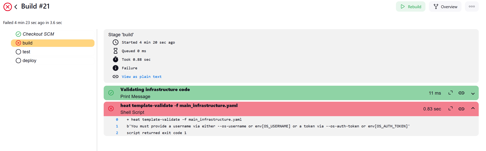
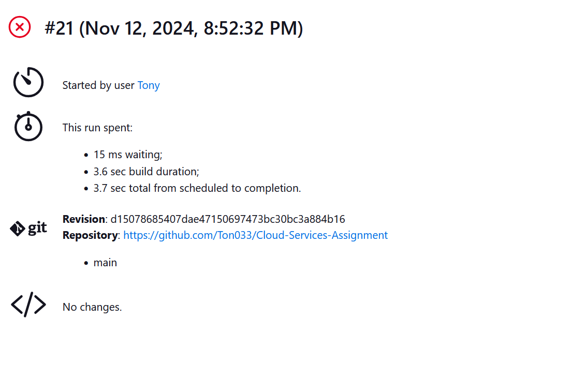

# Cloud-Services-Assignment

Using jenking to implement a balanced test suite
Im using Jenkins to automate the deploymment of of infrastructure of main_infrastructure.yaml. 
The pipeline will have unit testing, syntax validation, integration testing, and final deployment.

Repository:
https://github.com/Ton033/Cloud-Services-Assignment

I keep getting errors during my builds

